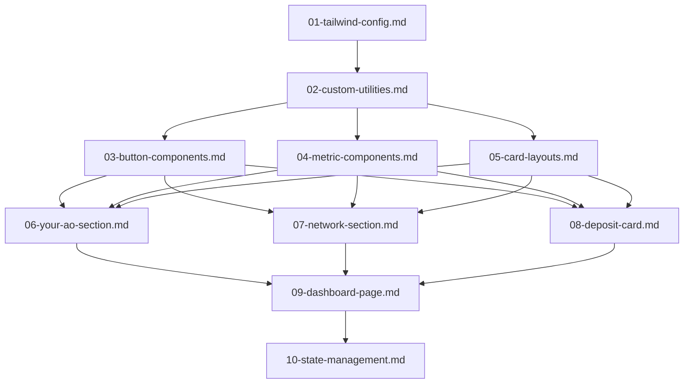

# AO Portal実装プロンプト実行ガイド

このディレクトリには、AO Portalライクなフロントエンド基盤を構築するためのClaude Codeプロンプトが含まれています。

## 技術スタック

- Next.js App Router + TypeScript
- TailwindCSS + Shadcn/ui
- Zustand + TanStack Query
- pnpm

## プロンプトファイル一覧

### Phase 1: デザイントークン定義

- `01-tailwind-config.md` - Tailwind設定の基盤構築
- `02-custom-utilities.md` - カスタムUtilityクラスの作成

### Phase 2: 基本コンポーネント

- `03-button-components.md` - ボタンコンポーネントの作成
- `04-metric-components.md` - メトリック表示コンポーネント
- `05-card-layouts.md` - カードレイアウトコンポーネント

### Phase 3: 複合コンポーネント

- `06-your-ao-section.md` - Your AOセクションコンポーネント
- `07-network-section.md` - Networkセクションコンポーネント
- `08-deposit-card.md` - Depositカードコンポーネント

### Phase 4: ページレベル統合

- `09-dashboard-page.md` - メインダッシュボードページ
- `10-state-management.md` - 状態管理とデータフェッチング

## 実行順序と依存関係



### 実行手順

1. **Phase 1を順番に実行**

   ```bash
   claude-code < prompts/01-tailwind-config.md
   claude-code < prompts/02-custom-utilities.md
   ```

2. **Phase 2を並行実行可能**

   ```bash
   claude-code < prompts/03-button-components.md
   claude-code < prompts/04-metric-components.md
   claude-code < prompts/05-card-layouts.md
   ```

3. **Phase 3を並行実行可能（Phase 2完了後）**

   ```bash
   claude-code < prompts/06-your-ao-section.md
   claude-code < prompts/07-network-section.md
   claude-code < prompts/08-deposit-card.md
   ```

4. **Phase 4を順番に実行**
   ```bash
   claude-code < prompts/09-dashboard-page.md
   claude-code < prompts/10-state-management.md
   ```

## 各プロンプトの概要

| ファイル名                | 目的                            | 作成されるファイル                                                                                                     |
| ------------------------- | ------------------------------- | ---------------------------------------------------------------------------------------------------------------------- |
| `01-tailwind-config.md`   | AO Portal用カラー・フォント定義 | `tailwind.config.ts`                                                                                                   |
| `02-custom-utilities.md`  | カスタムTailwindクラス          | `tailwind.config.ts` (plugin追加)                                                                                      |
| `03-button-components.md` | ボタンコンポーネント            | `src/components/ui/ao-button.tsx`<br>`src/components/ui/wallet-button.tsx`                                             |
| `04-metric-components.md` | 数値表示コンポーネント          | `src/components/ui/metric-item.tsx`<br>`src/components/ui/balance-display.tsx`                                         |
| `05-card-layouts.md`      | カードレイアウト                | `src/components/ui/section-card.tsx`<br>`src/components/ui/section-compact.tsx`                                        |
| `06-your-ao-section.md`   | Your AOセクション               | `src/components/sections/your-ao-section.tsx`                                                                          |
| `07-network-section.md`   | Networkセクション               | `src/components/sections/network-section.tsx`                                                                          |
| `08-deposit-card.md`      | Depositカード                   | `src/components/cards/deposit-card.tsx`                                                                                |
| `09-dashboard-page.md`    | メインページ統合                | `src/app/dashboard/page.tsx`<br>`src/components/layout/dashboard-layout.tsx`                                           |
| `10-state-management.md`  | 状態管理・データ層              | `src/stores/wallet-store.ts`<br>`src/hooks/use-wallet.ts`<br>`src/hooks/use-network-data.ts`<br>`src/lib/mock-data.ts` |

## 注意事項

- **必ず順序を守って実行してください** - 後のプロンプトは前のプロンプトで作成されたコンポーネントに依存しています
- **Phase内での並行実行は可能** - 同じPhase内のプロンプトは相互依存がありません
- **エラーが発生した場合** - 依存関係を確認し、必要なファイルが作成されているかチェックしてください
- **カスタマイズ** - 各プロンプトは独立しているため、必要に応じて要件を調整して実行できます

## 完成後の構造

```
src/
├── app/
│   └── dashboard/
│       └── page.tsx
├── components/
│   ├── ui/
│   │   ├── ao-button.tsx
│   │   ├── wallet-button.tsx
│   │   ├── metric-item.tsx
│   │   ├── balance-display.tsx
│   │   ├── section-card.tsx
│   │   └── section-compact.tsx
│   ├── sections/
│   │   ├── your-ao-section.tsx
│   │   └── network-section.tsx
│   ├── cards/
│   │   └── deposit-card.tsx
│   └── layout/
│       └── dashboard-layout.tsx
├── stores/
│   └── wallet-store.ts
├── hooks/
│   ├── use-wallet.ts
│   └── use-network-data.ts
└── lib/
    └── mock-data.ts
```

このプロンプト群を実行することで、AO Portalと同等の見た目・機能を持つフロントエンド基盤が完成します。
